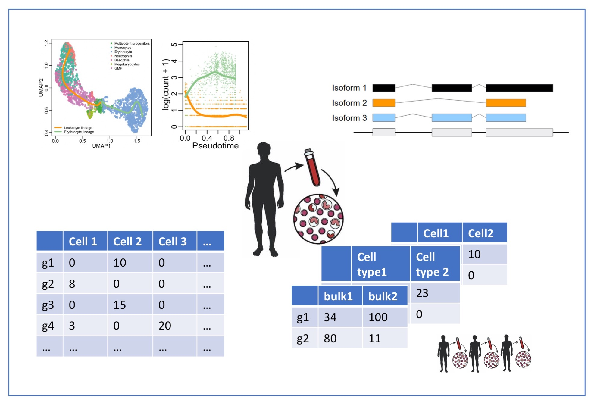

```{r echo=FALSE, warning=FALSE, message=FALSE}

```


# Course Description

High-throughput 'omics studies generate ever larger datasets and, as a consequence, complex data interpretation challenges. This course focusses on statistical concepts involved in preprocessing, quantification and differential analysis of high-throughput 'omics data. The core focus will be on shotgun proteomics and (bulk and single-cell) RNA-sequencing. Experimental design is essential to allow for correct interpretation in all 'omics studies, and we will cover how to design a statistically efficient experiment, as well as discuss the impact experimental design has on how we model 'omics data, introducing concepts such as blocking. The course will rely exclusively on free and user-friendly open-source tools in R/Bioconductor. We hope that this will provide a solid basis for beginners, but will also bring new perspectives to those already familiar with standard data analysis workflows for proteomics and next-generation sequencing applications.

# Target Audience

This course is oriented towards biologists and bioinformaticians with a particular interest in differential analysis for quantitative 'omics data.

# Prerequisites

The prerequisites for the Statistical Genomics Analysis course are the successful completion of a basic course of statistics that covers topics on data exploration and descriptive statistics, statistical modeling, and inference: linear models, confidence intervals, t-tests, F-tests, anova, chi-squared test.
The basis concepts may be revisited in the online course at https://statomics.github.io/PSLS/ (English) and in https://statomics.github.io/sbc/ (Dutch).

In addition, knowledge of programming in `R` is preferred. A primer to `R` and Data visualization in `R` can be found at:

 - `R` Basics: https://dodona.ugent.be/nl/courses/335/
 - `R` Data Exploration: https://dodona.ugent.be/nl/courses/345/

# Software and data

1. For the course you need to install **R 4.6 or higher** from [cran](https://cran.r-project.org/). 

2. We also recommend you to use [rstudio](https://posit.co/products/open-source/rstudio) (optional)

3. To install all the necessary package, please use **R 4.6 or higher** and execute the code chunk below in the RStudio Console/R console:

```{r, eval = FALSE}
if (!requireNamespace("BiocManager", quietly = TRUE))
    install.packages("BiocManager")
BiocManager::install(c(
   "arrow",
   "BiocParallel",
   "BiocFileCache",
   "ComplexHeatmap",
   "dplyr",
   "ExploreModelMatrix",
   "ggpattern",
   "ggplot2",
   "ggrepel",
   "impute",
   "MsDataHub",
   "patchwork",
   "scater",
   "tidyr",
   "bookdown", 
   "iq",
   "QFeatures",
   "msqrob2",
   "kableExtra",
   "data.table",
   "ggcorrplot",
   "ggpubr",
   "callr",
   "curl",
   "httpuv"
))
```


# Detailed Program

## Introduction (Week 1) {-}

1. Position of the course: [HTML](./intro.html), [PDF](./intro.pdf)

2. Recap Linear Models

   - Lecture: [HTML](./recapGeneralLinearModel.html), [PDF](./recapGeneralLinearModel.pdf)
   - Tutorial KPNA2: [HTML](./multipleRegression_KPNA2.html),  [PDF](./multipleRegression_KPNA2.pdf)

## Module I: Proteomics Data Analysis (Week 2-5) {-}
### 1. Bioinformatics for proteomics {-}

   - Lecture MS-Basics: [PDF](./figs/part1_ms_basics.pdf)
   - Lecture Identification: [PDF](./figs/part2_identification.pdf)
   - Tutorials: [Identification](https://compomics.com/tutorials/posts/2026-06-01-bioinformatics-for-proteomics.html)

### 2. Statistics for Proteomics Data Analysis {-}

#### 2.1 Data Processing {-}

This parts introduces the user to the key concepts for data processing in differential proteomics data analysis and provides extensive description of the code. While this part is conceptual, the concepts are illustrated using a real spike-in study.

-  [Basic concepts](01-dataprocessing.html), [PDF](01-dataprocessing.pdf)
-  [Tutorial data processing](01-tutorial-data-processing.html), [PDF](01-tutorial-data-processing.pdf)
-  [Wrap-up data processing](02-workflow-optimisation.html), [PDF](02-workflow-optimisation.pdf)

#### 2.2 Statistical Inference & Design concepts {-}

- [Basics of Statistical Inference](03-inference.html), [PDF](03-inference.pdf)
- [Tutorial Differential Analysis and Design Aspects](03-tutorial-Design.html), [PDF](03-tutorial-Design.pdf)
- [Wrapup Blocking](03-blocking-wrapup.html), [PDF](03-blocking-wrapup.pdf)


## License {-}

<a rel="license"
href="http://creativecommons.org/licenses/by-sa/4.0/"></a><br
/>This material is licensed under a <a rel="license"
href="http://creativecommons.org/licenses/by-sa/4.0/">Creative Commons
Attribution-ShareAlike 4.0 International License</a>. You are free to
**share** (copy and redistribute the material in any medium or format)
and **adapt** (remix, transform, and build upon the material) for any
purpose, even commercially, as long as you give appropriate credit and
distribute your contributions under the same license as the original.
