# Organization of the course

## Module I: Quantitative Proteomics

  1. Identification and quantification of peptides and proteins
  2. Data exploration and quality control using plots
  3. Preprocessing: log-transformation, Filtering, Normalization,
Summarization
  4. Dealing with batch effects and other confounders
  5. Statistical Concepts

      1. Linear models/Linear mixed models
      2. Trade-off between biological relevance/effect size vs statistical
significance
      3. Empirical Bayes Methods
      4. Multiple testing

## Module II: Next generation sequencing (NGS, Transcriptomics)

  1. NGS Data exploration
  2. Preprocessing/normalization
  3. Additional Statistical Concepts

      1. Generalized linear models (GLM) for binary data
      2. GLM for count data
      3. Overdispersion

## Details

  1. Theory and Tutorials are blended

      - Module I: week 1-5
      - Module II: week 6-10
      - Project: week 1-10 via small assignments + week 11-12

  2.  Communication and submission of projects via Ufora
  3. All tutorials from week 2 onwards are based on
R/Bioconductor via R-studio
Scripts are made in R/markdown: a file format to combine
text, R code and R output.

# Setting the scene

Bioinformatics is an interdisciplinary field of science that develops methods and software tools for understanding biological data, especially when the data sets are large and complex.

However, before we focus on methods to build knowledge on biological processes, it is important to ask ourselves the question what life is.

When thinking about science it is crucial, as @bohm1980 nicely formulates, to acknowledge that scientific theories are not "true knowledge" corresponding to "the reality as is", but rather ever-changing insights that are giving shape and form to how we view and experience the world.

# What is life?

We will start this introduction with Bohm's example of a sunflower seed from which an entire plant is growing.
<div><div style="position:relative; padding-top: 56.25%">
<iframe src="https://www.youtube.com/embed/_owPRdbaMdY?si=Hpee5spcKofhWsEo" frameborder="0" allowfullscreen
      style=" position:absolute;top: 0;left: 0;width: 100%;height: 100%;"
allow="autoplay; encrypted-media" allowfullscreen data-external="1" start=25></iframe>
</div>
</div>
*Timelapse of a growing sunflower (Source: https://www.youtube.com/watch?v=_owPRdbaMdY)*

Remarkably, each plant cell contains all information from the seed, i.e. all its DNA as well as its cellular structure. However, as @bohm1980 points out the seed contains little to nothing from the actual biomass of the plant that it has developed. The seed merely contains the information that is required to transform its environment to grow the plant from solar energy and the chaos of simple molecules CO$_2$, nitrogen, phosphorous, etc. The plant will eventually produce new seeds, which will spread its information further throughout the environment and will transform it over and over again to grow plants. It thus becomes obvious that we do not need to make the distinction between "inanimate" and "animate" matter. Indeed, if we would stick to this old Cartesian way of thinking we are confronted with confusing questions like when would a so-called "inanimate" carbon atom become animate? As soon as it enters the leaf stomata or when it is assimilated into an organic compound? Does the carbon atom become inanimate again when it is released from the plant as it burns the sugars it has assimilated into CO$_2$ during the night?

Indeed, we can consider that the environment is augmented with the information of the seed, which somehow seems to direct its environment to grow a corresponding plant. So life itself can be regarded as belonging to a totality including plant and the environment. So @bohm1980 concludes that "we do not need to fragment the whole into life and inanimate matter, nor do we have to try to reduce life completely to nothing but an outcome of the latter".

## de Duve: a Biochemical View of Life

In his Book "Life Evolving - Molecules, Mind and Meaning", @deDuve2002 gave a very simple but brilliant definition of life:

Life is

1. One,
2. Chemistry, and
3. Information

In the following sections we will explore what de Duve meant with each component in his definition.

## Life is One {#sec-lifeOne}

Life is one because all living organisms on earth

- are built of cells
- evolved from the same species, LUCA, our last universal common ancestor
- use the same molecule for storing, converting and using energy
- use the same biological building blocks: lipids, sugars, amino acids for proteins and nucleic acids (DNA and RNA).


### All Living Organisms are Built of Cells

"Life is One" because all organisms are composed of cells.
Green algae that can perform photosynthesis are a beautiful example of unicellular organisms. They were key for the development of life on our planet by releasing oxygen in our atmosphere (@fig-greenAlgae).

```{r fig-greenAlgae, fig.cap='Cyanobacteria, unicellullar organisms that can perform photosynthesis. They were key in the development of life and radically changed Earth by releasing oxygen to our atmosphere (Source: Chisholm Lab, Wikipedia)', out.width='30%', fig.asp=.8, fig.align='center', echo=FALSE}
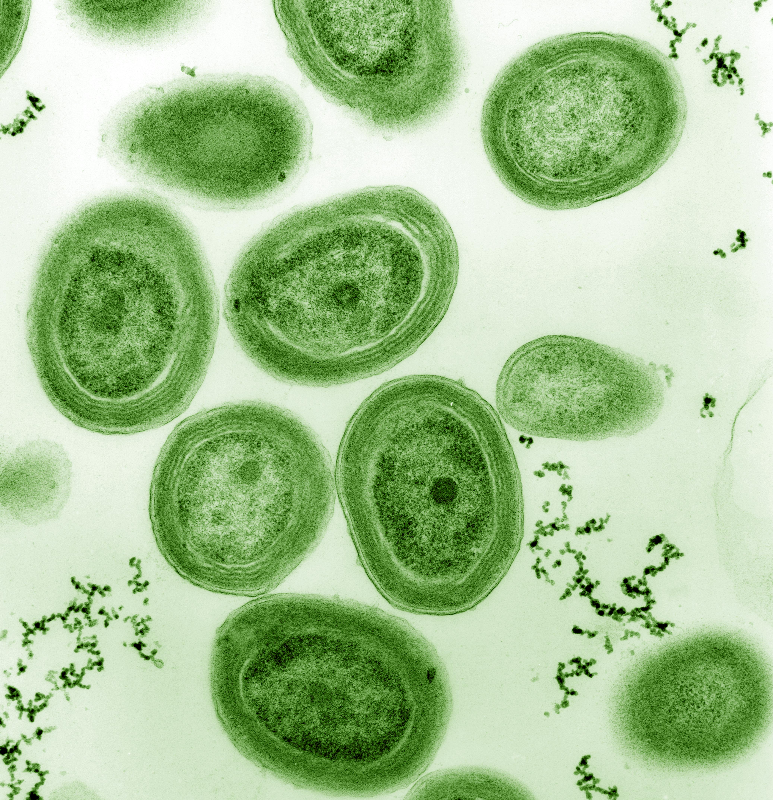
```

A vital component of a cell is its membrane (the outer layer of the cell) that is separating them from their environment while enabling them to interact with it and to concentrate chemicals inside the cell.


Multicellular organisms are composed of multiple cells. The cells are organised in
tissues, e.g. spongy tissue in our bones or epithelium cells of our stomach; organs, e.g. bones or our stomach; organ systems, e.g. skeleton or digestive system; up to the organism. @fig-multiCellular also shows how organisms are further organised in populations of organisms, ecosystems, and eventually our entire Biosphere. So "Life is One" because all living organisms consist of cells that are organised in large networks that work together.

```{r fig-multiCellular, fig.cap='Multicellular organisms and biological organisation (Source: mrssmithsbiology)', out.width='30%', fig.asp=.8, fig.align='center', echo=FALSE}
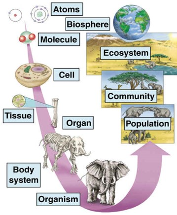
```

\pagebreak

#### Last Universal Common Ancestor

"Life is One" because all species evolved from the same ancestral population of cells.
This is also referred to as the Last Universal Common Ancestor (LUCA). It is nicely indicated by the tree of life in @fig-treeOfLife, which is one of the most important organising principles in biology. It shows the evolutionary relationships among different organisms and that all living beings eventually can be traced back to LUCA who is located at the root of the tree.  Note, that the animal kingdom to which we belong is only a small branch in the tree.

```{r fig-treeOfLife, fig.cap='The tree of life is one of the most important organising principles in biology. It shows the evolutionary relationships among different organisms and also that all living beings eventually can be traced back to the last universal common ancestor (LUCA), who is located at the root of the tree (Source: Wikipedia)', out.width='80%', fig.asp=.8, fig.align='center', echo=FALSE}
knitr::include_graphics("./figs/Phylogenetic_tree.svg")
```

#### Energy coin {#sec-sectionEnergyCoin}

"Life is One" because all living organisms use the same "energy coin", the ATP-ADP system, to store and reuse energy.
Adenosine-triphosphate (ATP) consists of a ribose sugar with 3 phosphate groups and a base adenine.
Splitting a phosphate group from adenosine-triphosphate (ATP) results in adenosine-diphosphate (ADP), a free phosphate group and energy.
The other way around, energy can be stored as chemical energy by binding a phosphate group to ADP (see @fig-atp-adp).

Note, that ATP is also used to build RNA, an important molecule involved in storing, passing and expressing our genetic information. Indeed, ATP is incorporated in RNA upon splitting two phosphate groups. The resulting AMP (adenosine monophosphate) is one of the building blocks of RNA. See @sec-sectionNucleicAcids for more details on RNA.  So there is a close link between energy and genetic information!


```{r fig-atp-adp, fig.cap='Our energy coin ATP-ADP. Adenosine-triphosphate (ATP) consists of a base adenine, a ribose sugar and 3 phosphate groups. Splitting a phosphate group from adenosine-triphosphate (ATP) by a reaction with water (H$_2$O) results in adenosine-diphosphate (ADP), a free phosphate group and releases energy. The other way around, energy can be stored as chemical energy by binding a phosphate group to ADP (Source: Adapted from Wikipedia)', out.width='70%', fig.asp=.8, fig.align='center', echo=FALSE}
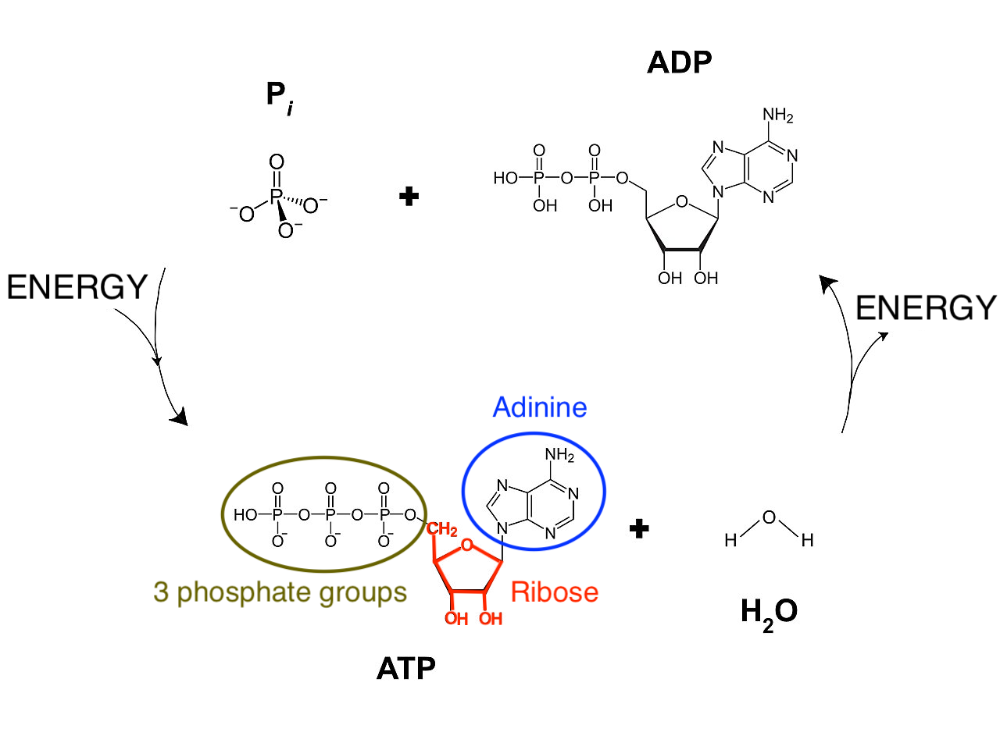
```

\pagebreak

#### Building Blocks of Life

"Life is One" because all living organisms are composed of the same basic bio-molecules and we all know more than we think about them because we are what we eat!

Almost all molecules of living organisms are composed of

1. Lipids, oil and fats, for storage and as building blocks for membranes,
2. Carbohydrates, sugars, for storing energy and as a backbone of large bio-molecules,
3. Amino acids, the building blocks of proteins, which are the workhorses of a cell and facilitate the majority of its chemical reactions, and
4. Nucleic Acids, building blocks of RNA and DNA, which are used to store and use the genetic information we inherit from our parents.


#### Lipids

Lipids, fats and oils, are used for

- storage of energy,
- regulation of hormones,
- transmission of nerve impulses,
- cushion vital organs and
- transport of fat-soluble nutrients.

Moreover, an important class of lipids, the phospholipids, make up membranes of cells and subcellular compartments called organelles see @fig-lipids. Indeed phospholipids have a polar head that likes to be in water and a long apolar tail that does not mix with water. Therefore bilayers of phospholipid molecules are spontaneously formed in aqueous solutions.

```{r fig-lipids, fig.cap='Phospho-lipids have a very important role in life as they form membranes. Phospholipids have a hydrophilic head that likes to mix with water and long hydrophobic tails that do not mix with water. They spontaneously give rise to bilayers in aqueous solutions similar to the structure seen in membranes. Membranes are the boundaries of the cell and they allow passive diffusion of small molecules through their bilayer. Larger molecules can be actively exchanged with the environment through membrane proteins (Source: Doug Hatfield, Wikipedia)', out.width='80%', fig.asp=.8, fig.align='center', echo=FALSE}
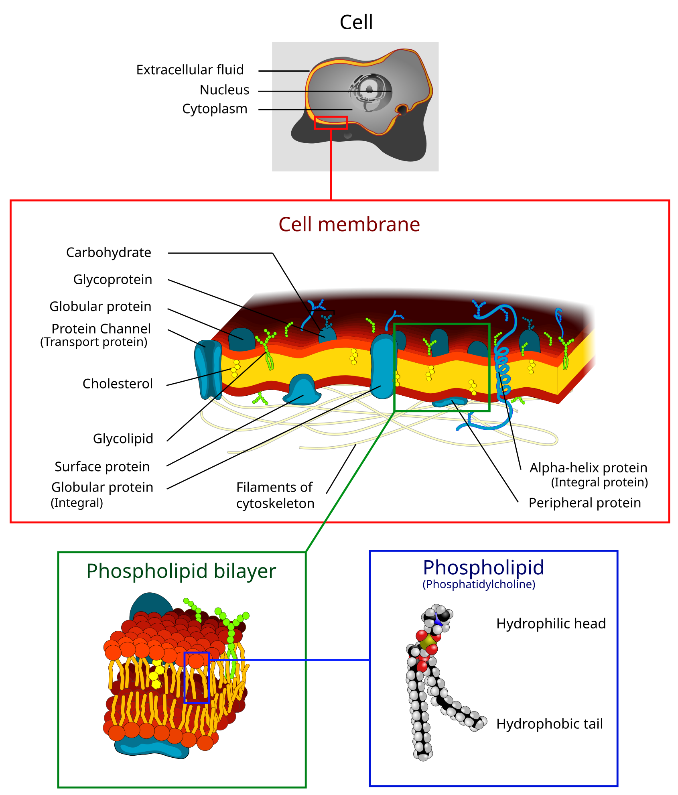
```

\pagebreak

Membranes provide the basis for concentrating specific molecules in (compartments of) living cells. This enable cells to build up a disequilibrium of chemical molecules that  can perform  work as a concentration gradient spontaneously dissipates toward its equilibrium value. So phospholipids are key for creating the boundary conditions necessary for cellular organization.

#### Carbohydrates

Carbohydrates are important bio-molecules that are used for

- storage,
- energy and
- structure (@fig-carbohydrates).

```{r fig-carbohydrates, fig.cap='Carbohydrates perform the important functions of storage, energy source and structure. They can be organised in biopolymers, long chains of carbohydrate molecules that are bound together. The polysaccharides starch and glycogen for instance are used to store energy by plant and animal cells, respectively. Cellulose, on the other hand, is a polysaccharide that gives plants structure. Deoxyribose and ribose are important carbohydrates that form the backbone of the biopolymers DNA and RNA, respectively. (Source: thebiologynotes.com)', out.width='100%', fig.asp=.8, fig.align='center', echo=FALSE}
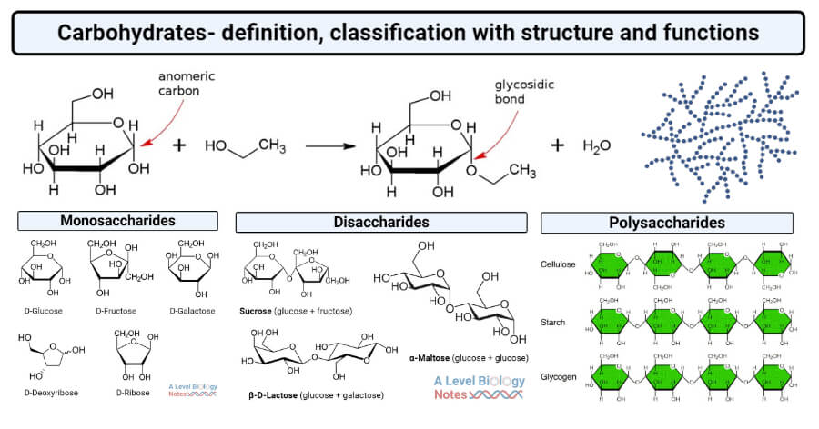
```

- Storage: glucose is stored inside animal cells using glycogen, a polymer of thousands of glucose molecules that are bound to each-other. Plants use a similar molecule, starch.
- Energy source: specific proteins can split glycogen and starch into glucose that is subsequently metabolized for energy.
- Structure: carbohydrates form the backbone of many bio-molecules, e.g. long chains of desoxyribose and ribose act as the backbone of the bio-polymers DNA and RNA, respectively; and glucose is the backbone of cellulose, which give plants structure.


</br>

\pagebreak

#### Amino Acids {#sec-sectionAminoAcids}

Amino Acids are the building blocks of proteins. Proteins are the main workhorses of the cell and they are important for

- moving food,
- digesting food,
- copying DNA,
- for giving the cell structure,
- affecting the rates at which other proteins work,
- etc...

Amino acids by themselves are simple molecules (@fig-aminoAcids).
Although hundreds of amino acids exist in nature, life is using only 20 of them and it is combining them in long molecules, polymers, which are referred to as proteins.
Proteins are hetero-polymers, consisting of the 20 amino acids that are arranged in long sequences that differ from protein to protein.
So unlike starch, that only consists of glucose molecules that are all identical, proteins are capable of carrying information.

```{r fig-aminoAcids, fig.cap='Amino acids are simple molecules. They can be combined  in long molecules, polymers, also known as proteins. Their long chain of amino acids spontaneously folds into a complex 3D structure from which their biological function emerges (Source: thebiologynotes.com)', out.width='100%', fig.asp=.8, fig.align='center', echo=FALSE}
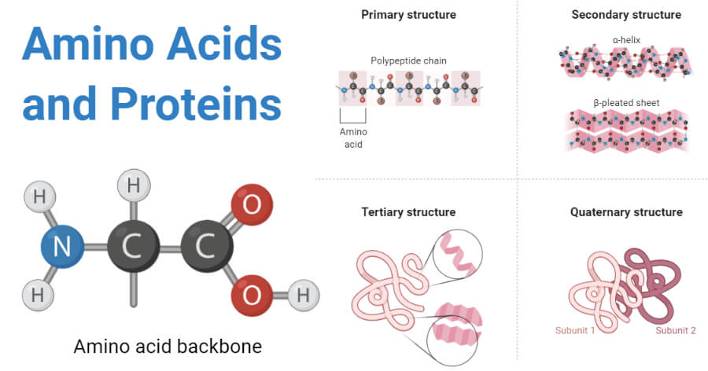
```

The crux of proteins is that their long chain of amino acids spontaneously folds into a complex 3D structure, which is determined by the properties and the specific sequence of its amino acids. From their complex and specific 3D structure their biological function emerges.

Indeed, many proteins work as a "lock" in which specific (bio)molecules fit as a "key". This enables proteins to bring molecules close together and to promote chemical reactions without being consumed.  This process is also referred to as catalysis and proteins that perform catalysis are called enzymes, see @fig-enzyme.

```{r fig-enzyme, fig.cap='Diagram of a protein performing an enzyme action (Source: Wikipedia)', out.width='50%', fig.asp=.8, fig.align='center', echo=FALSE}
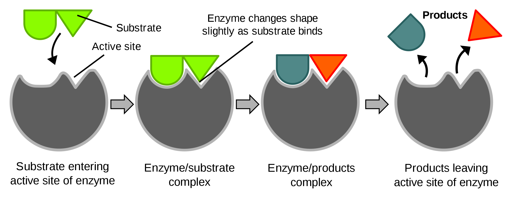
```


#### Nucleic Acids {#sec-sectionNucleicAcids}

Nucleic acids are built of nucleotides.
Each nucleotide is composed of one of four nitrogen-containing nucleobases, which carry the information

1. cytosine [C],
2. guanine [G],
3. adenine [A] or
4. thymine [T] (DNA) or uracil [U] (RNA) ,

a phosphate group and a sugar, i.e. ribose in ribonucleic acid (RNA, @fig-RNA) and deoxyribose in deoxyribonucleic acid (DNA, @fig-DNA).

These nucleotides are the building blocks that are combined in long polymers: RNA and DNA.
DNA and RNA are hetero-polymers and the nucleotides conceptually can be combined in any order.
So they can contain information.
Indeed, they are key to store and use the genetic information we inherit from our parents.

DNA typically occurs as a double strand, where C and G, and, A and T hybridize to each other using respectively three and two hydrogen bridges to form the iconic double stranded helix structure, see @fig-DNA.

There is a general consensus that life probably began by using RNA as information carrier.
DNA, however, is much more stable and lasts longer in water than RNA. Therefore, DNA probably emerged later and is now used to store the genetic information in most organisms.

Life is also one because we share the same genetic code, but we refer to @sec-lifeInformation "Life is Information" for more details.

```{r fig-RNAvsDNA, fig.cap='Nucleic acid: RNA (left) and DNA (right). RNA appears typically in a single strand and DNA as a double stranded molecule (Source: Wikipedia)', out.width='50%', fig.align='center', echo=FALSE}
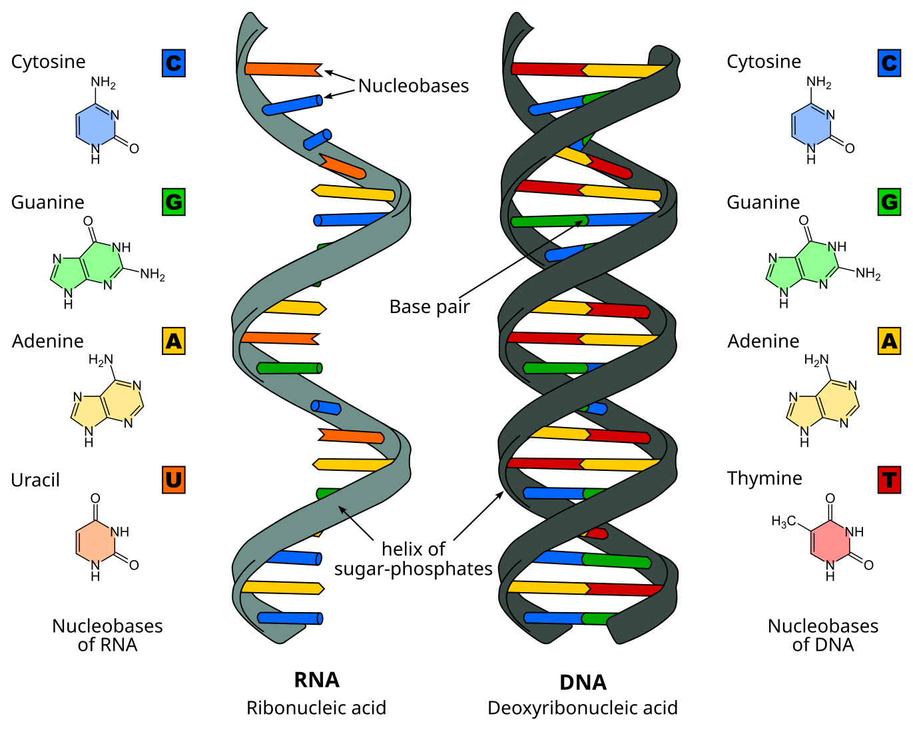
```

```{r fig-RNA, fig.cap='RNA is a polymeric molecule with various biological roles in coding, decoding, regulation and expression of genes. RNA consists of a chain of nucleotides. Each nucleotide is build from a ribose sugar that forms the backbone of the RNA  polymer, a phosphate group that is used to connect the ribose sugar molecules and a base adenine (A), cytosine (C), guanine (G) or uracil (U) that are the carriers of information. The bases can form hydrogen bonds between cytosine and guanine, between adenine and uracil, and, between adenine and thymine (a base from DNA) (Source: Adapted from Wikipedia)', out.width='50%', fig.align='center', echo=FALSE}
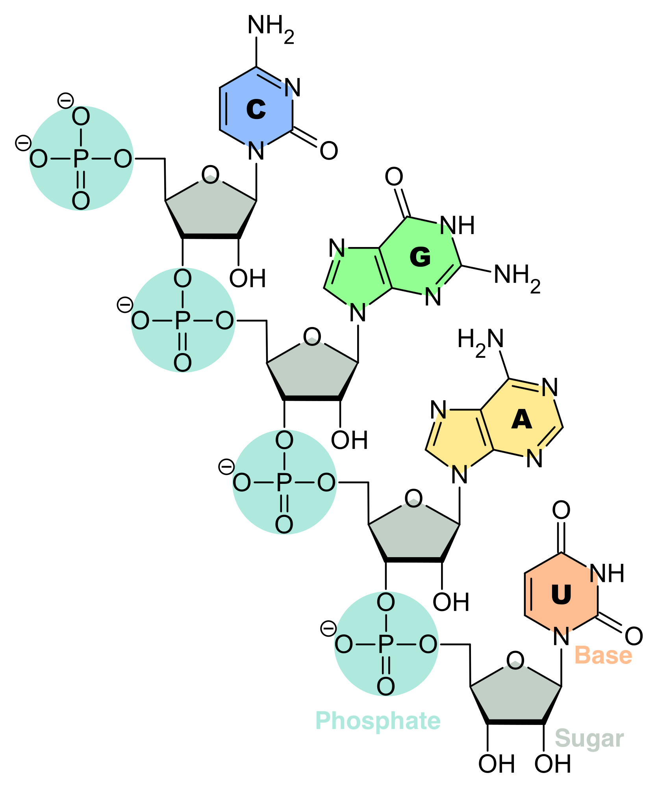
```
```{r fig-DNA, fig.cap='DNA is a polymer composed of two polynucleotide chains that coil around each other to form a double helix carrying genetic instructions for the development, functioning, growth and reproduction of all known organisms and many viruses. Each DNA single strand consists of a chain of nucleotides. Each nucleotide is build from a deoxyribose sugar that forms the backbone of the DNA  polymer, a phosphate group that is used to connect the deoxyribose sugar molecules and a base adenine (A), cytosine (C), guanine (G) or thymine (T) that are the carriers of information. The bases form hydrogen bonds between cytosine and guanine, and, adenine and thymine to assemble single stranded DNA in double stranded DNA. (Source: Wikipedia)', out.width='50%', fig.align='center', echo=FALSE}
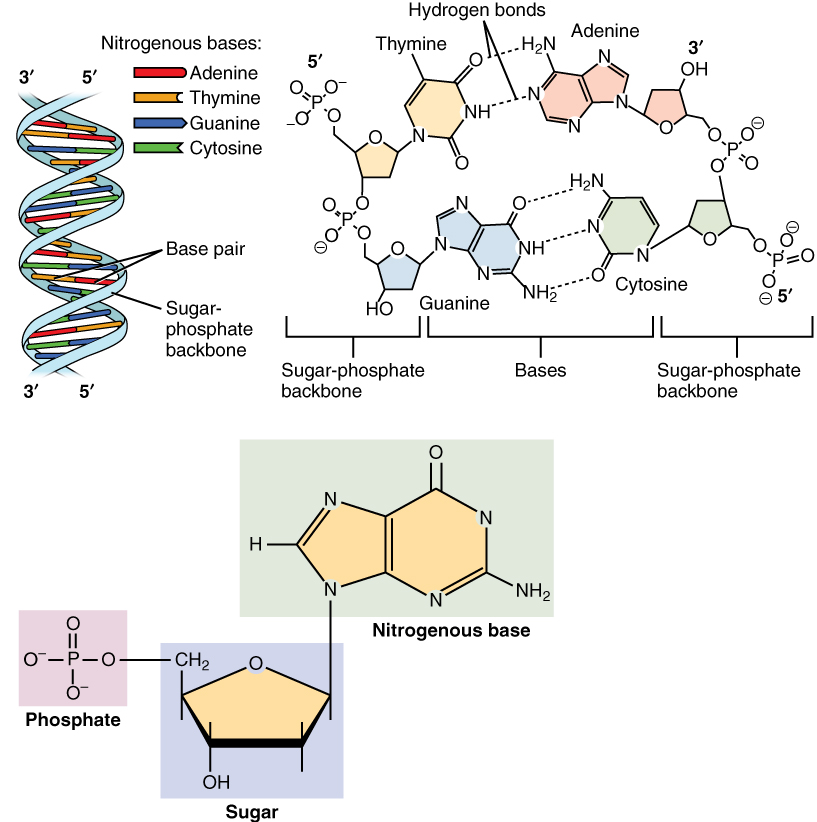
```


\newpage

## Life is Chemistry {#sec-lifeChemistry}

"Life is Chemistry" because a cell consists of a complex network of chemical reactions that are connected to each other. Many feedback loops exist in this chemistry making it largely nonlinear. The feedback loops enable a cell to maintain in its regime or to switch from regime or attractor upon external and/or internal stimuli. An overview of most reactions in a living cell is given in @fig-chemicalReactionsCell. You can zoom in on this map on http://biochemical-pathways.com/#/map/1.

```{r fig-chemicalReactionsCell, fig.cap='Network of the most important reactions in a living cell (Source: Dr. Gerhard Michal, Roche)', out.width='100%', fig.asp=.8, fig.align='center', echo=FALSE}
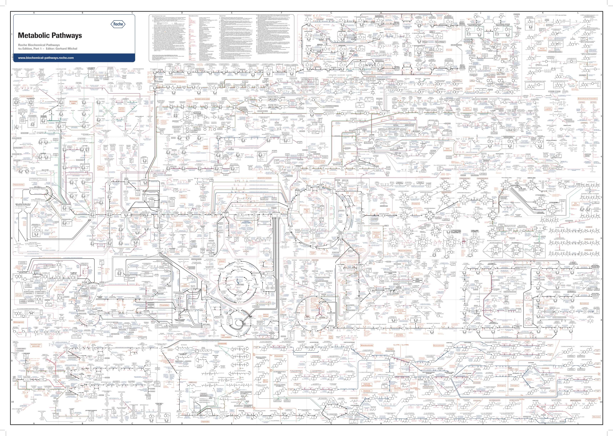
```

In the remainder of this section we will introduce energy and catalysis in more detail, and we also give an intriguing example of how proteins play a role in the self-organisation of a cell.

### Energy

"Life is Chemistry" because it uses chemical reactions to store and use energy. See the ATP-ADP system in @sec-sectionEnergyCoin

### Catalysis

"Life is Chemistry" because most chemical reactions are catalyzed, i.e. initiated, promoted and made faster by proteins. The proteins facilitate the reaction without being used. The reactions would never take place if we would only mix the molecules at the concentrations that are typically occurring in a cell.

A catalyst is a chemical substance that helps a reaction to take place without being consumed. Proteins that are catalysts are also referred to as enzymes.

Enzymes are proteins that

- initiate the reaction
- speed up the reaction and
- make sure that the outcome is always the same.

Loosely speaking they are

- "fishing" certain molecules from the complex mixture in a cell,
- which consists of thousands of chemical compounds generally at low concentrations,
- through binding sites they can facilitate that these molecules (substrates) are getting close so that they can react and form a new compound.

These binding sites emerged from the unique 3D structure of the protein. In @fig-enzyme a schematic overview is given of the enzyme action of a protein.

In most cases enzymes work together in pathways, which consist of multiple chemical reactions for which (part of the) molecules produced in the previous reaction are used by another enzyme to facilitate the next reaction.

The Krebs cycle is a well known example. This pathway is the main source of energy for a cell through metabolising carbohydrates, lipids and/or proteins. The Krebs cycle is a cyclic pathway of multiple chemical reactions each catalyzed by another enzyme (see @fig-krebsCycle or the you tube movie  https://www.youtube.com/embed/yk14dOOvwMk).

The Krebs cycle is also used to generate building blocks for constructing certain nucleotides and amino acids.

```{r fig-krebsCycle, fig.cap='Krebs cycle, a cyclic pathway connecting multiple reactions that provide the main source of energy for our cells by metabolising carbohydrates, proteins and lipids. Each reaction is catalyzed by an enzyme  (Source: Narayanese, Wikipedia)', out.width='70%', fig.asp=.8, fig.align='center', echo=FALSE}
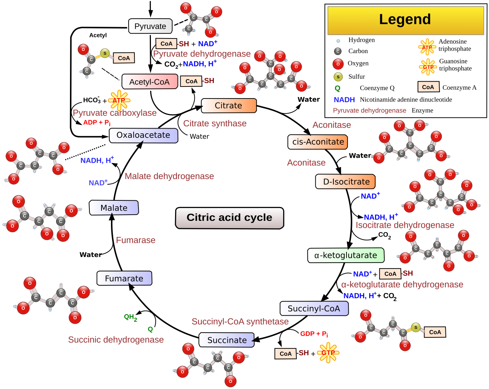
```

We can end this section with a quote of @deDuve2002: "Any living organism is a reflection of its enzyme arsenal".

\newpage

## Life is Information {#sec-lifeInformation}

Our genetic information to build all our bio-molecules, which we inherit from our parents, is stored in our DNA. DNA is a hetero-polymer  or a long chain of  4 different building blocks,  nucleotides.  So the genetic information is stored in an alphabet of 4 letters. This is
adenine (A), cytosine (C), guanine (G) and thymine (T) for DNA.

  It makes no physical or chemical difference what the identity of the next nucleotide is in the DNA chain. So our DNA can be seen as a coding system to store and pass genetic information from one generation to the next. Life is therefore also information and not only chemistry. It is absolutely mind blowing how variation in the sequence of this "four letter code" can lead to such a wealth of distinct characteristics and functions that can be observed between different specimens of the same species, and, even more so between different life forms.

In the remainder of this section we will focus on the flow of information in a cell in more detail.

### The "central paradigm" of molecular biology

The "central paradigm" of molecular biology states that the sequence of nucleotides in DNA are first *transcribed* into RNA and then *translated* into proteins, see @fig-centralParadigm.

Note, that some RNA molecules are also end products. Indeed RNA can also have a catalytic function, i.e. initiate and promote chemical reactions without being consumed.

A *gene* is the unit of genetic material, a DNA sequence that is encoding for the synthesis of a gene product, either a protein or a functional RNA.

```{r fig-centralParadigm, fig.cap='Central paradigm of biology: a gene, a specific region in the DNA, is first transcribed into RNA and then into proteins. Note, that for RNA-genes the RNA molecule is the end product itself, which is referred to as non-coding RNA (ncRNA) (Source: Thomas Shafee, Wikipedia)', out.width='50%', fig.asp=.8, fig.align='center', echo=FALSE}
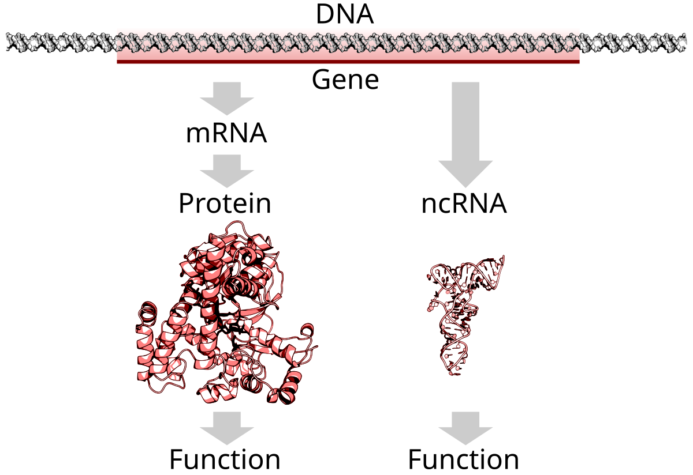
```


</br>

@fig-transcriptionTranslation shows the process of transcription of a gene from DNA to RNA and the translation of RNA to proteins.

1. The transcription of DNA to RNA is initiated by opening the
DNA double strand. Then a complementary RNA strand is synthesized by exploiting that A hybridizes to U (or T) and G to C through hydrogen bonds.

2. Once that the complementary RNA strand is made, it is further processed in the nucleus into messenger RNA (mRNA). The mRNA travels from the cell nucleus to the cell cytosol (cell liquid) where it is translated into proteins, and, where the majority of the reactions take place.

3. There mRNA is translated into proteins by ribosomes.
In the ribosomes the mRNA is bound to transfer RNA (tRNA). tRNA can bind to the mRNA molecule if it has 3 consecutive nucleotides that are complementary to the triplet of the 3 consecutive nucleotides on the mRNA template that is lying in the ribosome.

4. The transfer RNA transports one specific amino-acid that is then incorporated in the protein that is being formed, which is the growing amino acid chain in @fig-transcriptionTranslation. The sequence of 3 consecutive nucleotides of DNA of a gene is therefore also called a *codon* because it encodes for a specific amino acid.

5. Upon incorporation, the ribosome shifts to the next triplet of the mRNA and the next transfer RNA is bound to it, and so on until a stop codon is reached and the protein is finished.

```{r fig-transcriptionTranslation, fig.cap='In the cell nucleus the DNA strand opens up and is transcribed into an RNA molecule. Upon processing, the messenger RNA (mRNA) travels from the nucleus to the cytosol where it is translated into proteins. The mRNA is the template that fits into a ribosome that has the function to bind transfer RNA molecules to the mRNA template. It does that by hybridising to a tRNA, which has a triplet of three nucleotides that are complementary to those of the mRNA template. The tRNAs have a amino acid on their tail, which is incorporated into a long chain of amino acids, the protein that is produced. If the amino acid is incorporated, the ribosome moves to the next triplet and the process happens all over with a new tRNA  (Source: [tokresources.org](http://www.tokresource.org/tok_classes/biobiobio/biomenu/transcription_translation/))', out.width='50%', fig.asp=.8, fig.align='center', echo=FALSE}
#knitr::include_graphics("https://aholdencirm.files.wordpress.com/2016/06/transcription_2.jpg")
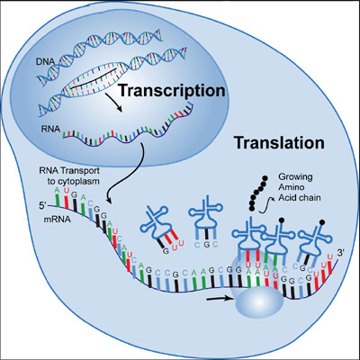
```


There are in total 64=4$^3$ codons encoding for each of the 20 amino acids, and, for a start and a stop codon to initiate and stop the protein translation,  respectively. Hence, there is a redundancy in the code, see @fig-codonTable.

```{r fig-codonTable, fig.cap='Codon table connecting triplets of nucleotids to amino acids (Source: Wikipedia)', out.width='50%', fig.asp=.8, fig.align='center', echo=FALSE}
knitr::include_graphics("./figs/Aminoacids_table.svg")
```


We can learn an important message from the codon table:

- There is no chemical necessity that explicitly connects the three nucleotides "CGG" to the amino acid arginine rather than to glutamine.

- Nucleotides themselves do not seem to a have chemical connection to the amino acids they encode

- Therefore we call it a code or information rather than just "genetic chemistry"

The code apparently evolved so that many mutations give rise to

  - synonymous codons (same amino acid) or
  - to incorporate amino acids that are similar

so that protein function is conserved.

</br>

DNA is thus the carrier of genetic information. However, RNA plays a more central role:

- Messenger RNA brings the genetic information from the cell nucleus to the cell cytosol where they are translated into proteins and where most of the chemical reactions take place.
- Ribozymes, i.e. catalytic RNA molecules, initiate and speed up particular reactions
- Transfer RNA plays an crucial role in the translation of proteins
- An RNA primer, i.e. a small RNA molecule, is essential to copy DNA
- RNA also acts as carrier of genetic information, e.g. corona virus.

# References {-}
