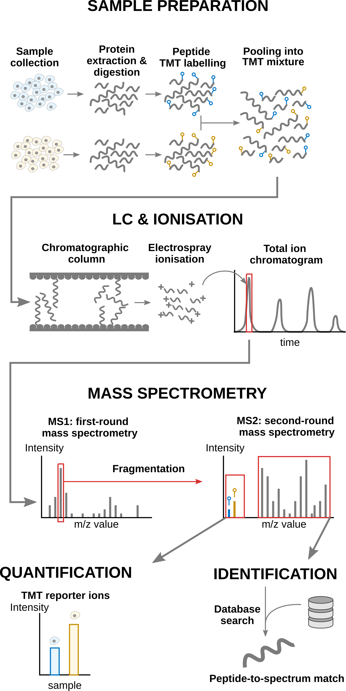

```{r setup, echo = FALSE}
knitr::opts_chunk$set(
    warning = FALSE,
    message = FALSE
)
```


<a rel="license"
href="https://creativecommons.org/licenses/by-nc-sa/4.0"></a>

This is part of the online course [Statistical Genomics Analysis
(SGA)](https://statomics.github.io/SGA/)

This chapter builds upon the [introductory
course](https://statomics.github.io/SGA/francisellaMixedModel.html) to
mixed models for proteomics data analysis. We will here cover more
advanced concepts using `msqrob2`. To illustrate these advanced
concepts, we will use the spike-in study published by @Huang2020-lu.
We chose this data set because:

1. Spike-in data contain ground truth information about which proteins 
   are differentially abundant, enabling us to show the impact of 
   different analysis strategies.
2. It has been acquired with a TMT-labelling strategy that require a
   complex experimental design. This provides an excellent example
   to explain the different sources of variability in an MS experiment
   and demonstrate the flexibility of `msqrob2` to model this
   variability.

## Background 

Labelling strategies in mass spectrometry (MS)-based proteomics 
enhance sample throughput by enabling the acquisition of multiple
samples within a single run. The labelling strategy that allows the 
highest multiplexing is the tandem mass tag (TMT) labelling and will
be the focus of the current tutorial.

### TMT workflow

TMT-based workflow highly overlap with [label-free
workflows](https://statomics.github.io/SGA/pda_quantification_preprocessing.html#11_MS-based_workflow).
However, TMT-based workflows have an additional sample preparation
step, where the digested peptides from each sample are labelled with a
TMT reagent and samples with different TMT reagents are pooled in a
single TMT mixture. The signal processing is also
slightly affected since the quantification no longer occurs in the MS1
space but at the MS2 level. It is important to understand that TMT
reagent are isobaric, meaning that the same peptide with different TMT
labels will have the same mass for the intact ion, as recorded during
MS1. However, the TMT fragments that are released upon fragmentation
during MS2, also called TMT reporter ions, have label-specific masses.
The TMT fragments have an expected mass and are distributed in a
low-mass range of the MS2 space. The intensity of each TMT fragment is
directly proportional to the peptide quantity in the original sample
before pooling. The TMT fragment intensities measured during MS2 are
used as quantitative data. The higher mass range contains the peptide
fragments that compose the peptide fingerprint, similarly to LFQ. This
data range is therefore used for peptide identification.
Interestingly, the peptide fingerprint originates from the same
peptide across multiple samples. This leads to a signal boost for low
abundant peptides and hence should improve data sensitivity and
consistency.

```{r, echo = FALSE, out.width = "75%", fig.cap = "Overview of an TMT-based proteomics workflow."}

```

### Challenges 

The analysis of TMT-based proteomics data shares the same challenges
as the data analysis challenges for LFQ:

- MS-based proteomics doesn't measure proteins directly, but their 
constituting **peptide ions**. The protein-level information needs
to be reconstructed from the ion data. In this tutorial, we will
start from the peptide data, which has been constructed from the ion
data by MaxQuant.
- All peptides cannot be ionised with the same efficiency. Poor 
ionisation will lead to reduced signal as less ions will hit the
detector, hence leading to a huge variability in intensity among
different peptide species, even when they originate from the same
protein.
- The identification step is not trivial and prone to 
errors. PSM misidentification leads to the assignment of a
quantitative values from another peptide with likely another
ionisation efficiency and relative abundance. Hence this misassigned
value will become an outlier.
- Moreover, the ion selection for MS2 depends on its
intensity (recall that only the top most intense ion peaks are send
for MS2). Therefore, the chance to measure and, subsequently, 
identify a peptide will depend on its abundance. Non identified
peptides will lead to data missingness, which is related to the
underlying quantification value. This phenomenon is known as
missingness not at random. Next to that, many reasons can lead to
ions not being selected or identified irrespective of their 
quantification value leading to missingness that is not related to
its quantitative value. This is referred to as missingness 
completely at random. The missingness issue is not negligible: only
41\% of all proteins are quantified across all samples, and the 
number drops to 6.6\% when considering peptides.
- The identification issues lead to unbalanced peptide missingness
across samples, and the patterns of missing values are potentially
different for every peptide, highlighting the need for an
automatised solution that is robust against missing values.
- Technical variations during the experiment can lead to systematic 
fluctuations across samples. The most obvious reason is when
different sample amounts are injected into the instruments, due to
small pipetting inconsistencies for instance. However, these
differences lead to unwanted variation that should be discarded when
answering biological questions.
- TMT workflows impose an additional challenge. Contemporary
  experiments often involve increasingly complex designs, where the
  number of samples exceeds the capacity of a single TMT mixture,
  resulting in a complex correlation structure that must be addressed
  for accurate statistical inference. We will describe in the
  modelling section the different sources of variation.

### Experimental context

The data set used in this chapter is a spike-in experiment
(PXD0015258) published by @Huang2020-lu. It consists of controlled
mixtures with known ground truth. UPS1 peptides at concentrations of
500, 333, 250, and 62.5 fmol were spiked into 50 g of SILAC HeLa
peptides, each in duplicate. These concentrations form a dilution
series of 1, 0.667, 0.5, and 0.125 relative to the highest UPS1
peptide amount (500 fmol). A reference sample was created by combining
the diluted UPS1 peptide samples with 50g of SILAC HeLa peptides. All
dilutions and the reference sample were prepared in duplicate,
resulting in a total of ten samples. These samples were then treated
with TMT10-plex reagents and combined before LC-MS/MS analysis. This
protocol was repeated five times, each with three technical
replicates, totaling 15 MS runs.

We will start from the PSM data generated by Skyline and infer
protein-level differences between samples. To achieve this goal, we
will apply an msqrob2TMT workflow, a data processing and modelling
workflow dedicated to the analysis of TMT-based proteomics datasets.
We will demonstrate how the workflow can highlight the spiked-in
proteins. Before delving into the analysis, let us prepare our
computational environment.

## Load packages

We load the `msqrob2` package, along with additional packages for
data manipulation and visualisation.

```{r}
library("msqrob2")
library("dplyr")
library("ggplot2")
library("patchwork")
```

We also configure the parallelisation framework.

```{r}
library("BiocParallel")
register(SerialParam())
```

## Data

The data have been deposited by the authors in the `MSV000084264`
MASSiVE repository, but we will retrieve the time stamped data from
our [Zenodo repository](https://zenodo.org/records/14767905). We need
2 files: the Skyline identification and quantification table generated
by the authors and the sample annotation files.

To facilitate management of the files, we download the required files
using the `BiocFileCache` package. The chunk below will take some time
to complete the first time you run it as it needs to download the
(large) file locally, but will fetch the local copy the following
times.

```{r download_data}
library("BiocFileCache")
bfc <- BiocFileCache()
psmFile <- bfcrpath(bfc, "https://zenodo.org/records/14767905/files/spikein1_psms.txt?download=1")
annotFile <- bfcrpath(bfc, "https://zenodo.org/records/14767905/files/spikein1_annotations.csv?download=1")
```

Now the files are downloaded, we can load the two tables. 


### PSM table

An MS experiment generates spectra. Each MS2 spectra are used to infer 
the peptide identity thanks to a search engine. When
an observed spectrum is matched to a theoretical peptide spectrum, we
have a peptide-to-spectrum match (PSM). The identification software
compiles all the PSMs inside a table. Hence, the PSM data is the
lowest possible level to perform data modelling.

Each row in the PSM data table contains information for one PSM (the
table below shows the first 6 rows). The columns contains various
information about the PSM, such as the peptide sequence and charge,
the quantified value, the inferred protein group, the measured and
predicted retention time and precursor mass, the score of the match,
... In the case of TMT data, the quantification values are provides in
multiple columns (start with `"Abundance."`), one for each TMT label.
Regardless of TMT or LFQ experiments, the PSM table stacks the
quantitative values from samples in different runs below each other.

```{r}
psms <- read.delim(psmFile)
qcols <- grep("Abundance", colnames(psms), value = TRUE)
```
```{r, echo=FALSE}
knitr::kable(head(psms))
```

There is a peculiarity with the dataset: the spectra have been
identified with 2 nodes. In one node, the authors searched the
SwissProt database for proteins with static modifications related to
the metabolic labelling, in the other node they searched the Sigma_UPS
protein database without these static modifications. However, some
spectra were identified by both nodes leading to duplicate PSMs. We
here remove these duplicated PSMs that are identification artefacts.

```{r}
duplicatesQuants <- duplicated(psms[, qcols]) | duplicated(psms[, qcols], fromLast = TRUE)
psms <- psms[!duplicatesQuants, ]
```

We will also subset the data set to reduce computational costs. If you
want to run the analysis on the full data set, you can skip this code
chunk. The subsetting will keep all UPS proteins, known to be
differentially abundant by experimental design, and we will keep 500
background proteins known to be unchanged across condition.

```{r}
allProteins <- unique(psms$Protein.Accessions)
upsProteins <- grep("ups", allProteins, value = TRUE)
helaProteins <- grep("ups", allProteins, value = TRUE, invert = TRUE)
set.seed(1234)
keepProteins <- c(upsProteins, sample(helaProteins, 500))
psms <- psms[psms$Protein.Accessions %in% keepProteins, ]
```

### Sample annotation table

Each row in the annotation table contains information about one
sample. The columns contain various descriptors about the sample, such
as the name of the sample or the MS run, the treatment (here the
spike-in condition), the lab that acquired the sample or any other
biological or technical information that may impact the data quality
or the quantification. Without an annotation table, no analysis
can be performed. The annotation table used in this tutorial has been
generated by the authors.

```{r}
coldata <- read.csv(annotFile)
```

We perform a little cleanup for concise output, and rename the
`Channel` column to `Label` because it contains information about the
TMT label used.

```{r}
coldata <- coldata[, c("Run", "Channel", "Condition", "Mixture", "TechRepMixture")]
coldata$File.Name <- coldata$Run
coldata$Run <- sub("^.*(Mix.*).raw", "\\1", coldata$Run)
colnames(coldata)[2] <- "Label"
```
```{r, echo=FALSE}
knitr::kable(head(coldata))
```

### Create the QFeatures object

We use `readQFeatures()` to create a `QFeatures` object. Since we
start from the PSM-level data, the approach is somewhat more
elaborate. You can find an illustrated step-by-step guide in the
[QFeatures
vignette](https://rformassspectrometry.github.io/QFeatures/articles/read_QFeatures.html).
First, recall that every quantitative column in the PSM table contains
information for multiple runs. Therefore, the function split the table
based on the run identifier, given by the `runCol` argument (for
Skyline, that identifier is contained in `Spectrum.File`). So, the
`QFeatures` object after import will contain as many sets as there are
runs. Next, the function links the annotation table with the PSM data.
To achieve this, the annotation table must contain a `runCol` column
that provides the run identifier in which each sample has been
acquired, and this information will be used to match the identifiers
in the `Spectrum.File` column of the PSM table. The annotation table
must also contain a `quantCols` column that tells the function which
column in the PSM table contains the quantitative information for a
given sample. In this case, the `quantCols` depend on

```{r}
coldata$runCol <- coldata$File.Name
coldata$quantCols <- paste0("Abundance..", coldata$Label)
(spikein <- readQFeatures(
  psms, colData = coldata,
  runCol = "Spectrum.File",
  quantCols = qcols
))
```

We now have a `QFeatures` object with 15 sets, each containing data
associated with an MS run. The name of each set is defined by the name
of the corresponding file name of the run, which is unnecessarily
long. We simplify the set names, although this step is optional and
only meant to improve the clarity of the output.

```{r}
## This is optional
names(spikein) <- sub("^.*(Mix.*).raw", "\\1", names(spikein))
(inputNames <- names(spikein))
```

## Data preprocessing

We will follow a similar data processing workflow as before.

### Encoding missing values

Any zero value needs to be encoded by a missing value.

```{r}
spikein <- zeroIsNA(spikein, inputNames)
```

### Log2 transformation

Log2-transformation solves the heteroskedasticity issue, but also
provides a scale that directly relates to biological interpretation.

```{r}
logNames  <- paste0(inputNames, "_log")
spikein <- logTransform(
    spikein, inputNames, name = logNames, base = 2
)
```

### Sample filtering

We remove the reference samples since `msqrob2` workflows do not
use reference normalisation.

```{r}
spikein <- subsetByColData(spikein, spikein$Condition != "Norm")
```

### PSM filtering

Filtering removes low-quality and unreliable PSMs that would otherwise
introduce noise and artefacts in the data. Conceptually, PSM filtering
is identical to peptide filtering, but we will here apply filtering
criteria for which some are not readily available in the data.
Therefore, we will add custom filtering variable to the `rowData` that
will then be used with `filterFeatures()`. This provides an ideal use
case to demonstrate the customisation of a filtering workflow.

#### Remove ambiguous identifications

The background proteins originate from HeLa cells, which also contain
UPS proteins. The background UPS proteins and the spiked-in UPS
proteins differ in metabolic labelling, so we should be able to
distinguish them. We used the PSM-level data searched with mascot, as
provided by the MSstatsTMT authors who used two mascot identification
nodes. In one node they searched the SwissProt database for proteins
with static modifications related to the metabolic labelling, in the
other node they searched the Sigma_UPS protein database without these
static modifications. Ideally, this should separate the spiked-in UPS
proteins and the UPS proteins from the HeLa cells, however, this is
not always the case. The SwissProt search is expected to return
peptide-spectrum matches (PSMs) for all proteins, including non-UPS
HeLa, UPS HeLa, and spike-in UPS proteins. Conversely, the Sigma_UPS
search is expected to return PSMs exclusively for spike-in UPS
proteins. However, a PSM that matches a UPS protein in the SwissProt
search but is not identified as such in the Sigma_UPS search could
either correctly originate from a HeLa protein or represent a
spiked-in UPS protein that was not recognised as such in the Sigma_UPS
search. Additionally, there are ambiguous PSMs that are not matched to
a UPS protein in the HeLa search but are matched to a UPS protein in
the SwissProt search. To address this, we exclude these ambiguous
proteins from the analysis.

To define the amibiguous PSMs, we retrieve the PSM annotations from
the `rowData` and create a new colum indicating whether a PSM belongs
to a UPS protein or not, based on the protein SwissProt identifiers.
For this, we apply a custom filtering worklow:

1. **Collect data**: combine all the `rowData` information in a single
   table. We will apply the filter on the 

```{r}
rowdata <- rbindRowData(spikein, logNames)
```

2. **Compute new variable**: (2a) define whether the PSM's protein 
   group is a UPS protein and then (2b) define an ambiguous PSM as a
   PSM that is marked as UPS by the SwissProt identifier but not by
   the Sigma_UPS node (`Marked.as` column), and inversely.

```{r}
## 2a.
rowdata$isUps <- "no"
isUpsProtein <- grepl("ups", rowdata$Protein.Accessions)
rowdata$isUps[isUpsProtein] <- "yes"
## 2b.
rowdata$isUps[!isUpsProtein & grepl("UPS", rowdata$Marked.as)] <- "amb"
rowdata$isUps[isUpsProtein & !grepl("UPS", rowdata$Marked.as)] <- "amb"
```

3. **Reinsert in the rowData**: insert the modified table with new 
   information back in the `rowData` of the different sets. This means
   that the single table with `rowData` information needs to be split
   by each set. `split()` will produce a named list of tables and each
   table will be iteratively inserted as `rowData` of the set.

```{r}
rowData(spikein) <- split(rowdata, rowdata$assay)
```

4. **Apply the filter**: the filtering is performed by 
   `filterFeatures()` using the new information from the `rowData`. We
   specify `keep = TRUE` because the input sets (before
   log-transformation) do not contain the filtering variable, so we
   tell the function to keep all PSMs for the sets that don't have the
   variable `isUps`.

```{r}
spikein <- filterFeatures(spikein, ~ isUps != "amb", keep = TRUE)
```

#### Remove failed protein inference

Next, we remove PSMs that could not be mapped to a protein or that map
to multiple proteins, i.e. a protein group. For the latter, the
protein identifier contains multiple identifiers separated by a `;`).
This information is readily available in the `rowData`, so there is no
need for a custom filtering.

```{r}
spikein <- filterFeatures(
    spikein, ~ Protein.Accessions != "" & ## Remove failed protein inference
        !grepl(";", Protein.Accessions)) ## Remove protein groups
```

#### Remove inconsistent protein inference

We also remove peptide ions that map to a different protein depending
on the run. Again, this requires a custom filtering and we apply the
same filtering workflow as above.

```{r}
## 1. Collect data
rowdata <- rbindRowData(spikein, logNames)
## 2. Compute new variable
rowdata <- data.frame(rowdata) |>
    group_by(Annotated.Sequence, Charge) |>
    mutate(nProtsMapped = length(unique(Protein.Accessions)))
## 3. Reinsert in the rowData
rowData(spikein) <- split(rowdata, rowdata$assay)
## 4. Apply the filter
spikein <- filterFeatures(spikein, ~ nProtsMapped == 1, keep = TRUE)
```

#### Remove one-run wonders

We also remove proteins that can only be found in one run as such
proteins may not be trustworthy. In this case, 

```{r}
## 1. Collect data
rowdata <- rbindRowData(spikein, logNames)
## 2. Compute new variable
rowdata <- data.frame(rowdata) |>
    group_by(Protein.Accessions) |>
    mutate(nRuns = length(unique(assay)))
## 3. Reinsert in the rowData
rowData(spikein) <- split(rowdata, rowdata$assay)
## 4. Apply the filter
spikein <- filterFeatures(spikein, ~ nRuns > 1, keep = TRUE)
```

#### Remove duplicated PSMs

Finally, peptide ions that were identified with multiple PSMs in a run
are collapsed to the PSM with the highest summed intensity over the
TMT labels, a strategy that is also used by MSstats.

This filtering requires a more complex workflow because it mixes
information from the `rowData` (to obtain ion identities) with
quantitative data (to obtain PSM intensity ranks). We therefore 
compute the filtering variable for every set iteratively:

1. Get the `rowData` for the current set.
2. Make a new variable `ionID`.
3. We calculate the `rowSums` for each ion.
4. Make a new variable `psmRank` that ranks the PSMs for each ion 
   identifier based on the summed intensity.
5. We store the new information back in the `rowData`.

```{r}
for (i in logNames) { ## for each set of interest
    rowdata <- rowData(spikein[[i]]) ## 1.
    rowdata$ionID <- paste0(rowdata$Annotated.Sequence, rowdata$Charge) ## 2.
    rowdata$rowSums <- rowSums(assay(spikein[[i]]), na.rm = TRUE) ## 3.
    rowdata <- data.frame(rowdata) |>
        group_by(ionID) |>
        mutate(psmRank = rank(-rowSums)) ## 4.
    rowData(spikein[[i]]) <- DataFrame(rowdata) ## 5.
}
```

For each ion that maps to multiple PSMs, we keep the PSM with the
highest summed intensity, that is that ranks first. 

```{r}
spikein <- filterFeatures(spikein, ~ psmRank == 1, keep = TRUE)
```

#### Remove highly missing PSMs

We then remove PSMs with five or more missing values out of the ten
TMT labels (>= 50%). This is an arbitrary value that may need to be
adjusted depending on the experiment and the data set.

```{r}
spikein <- filterNA(spikein, logNames, pNA = 0.5)
```

### Normalisation

We normalise the data by median centering.

```{r}
normNames  <- paste0(inputNames, "_norm")
spikein <- normalize(
    spikein, logNames, name = normNames,
    method = "center.median"
)
```

And we confirm that the normalisation resulted in a correct alignment
of the intensity distribution across samples.

```{r, fig.width=5, fig.height=6}
spikein[, , normNames] |>
    longForm(colvars = c("Mixture", "TechRepMixture")) |>
    data.frame() |>
    ggplot() +
    aes(x = value, colour = as.factor(TechRepMixture), group = colname) +
    geom_density() +
    labs(title = "Intensity distribution for each observational unit",
         subtitle = "Before normalisation",
         colour = "Technical replicate") +
    facet_grid(Mixture ~ .) +
    theme(legend.position = "bottom")
```

### Summarisation

Below, we illustrate the challenges of summarising TMT data using one
of the UPS proteins in Mixture 1 (separating the data for each
technical replicate). We also focus on the 0.125x and the 1x spike-in
conditions. We illustrate the different peptide ions on the x axis and
plot the log2 normalised intensities across samples on y axis. All the
points belonging to the same sample are linked through a grey line.

```{r, echo = FALSE, fig.height=6, fig.width=6}
spikein[, , normNames] |>
    filterFeatures(~ Protein.Accessions == "P02787ups") |> 
    longForm(colvars = colnames(colData(spikein)), rowvars = "ionID") |> 
    data.frame() |> 
    filter(Mixture == "Mixture1" & Condition %in% c("1", "0.125")) |> 
    rename(Replicate = "TechRepMixture") |> 
    mutate(colname = factor(colname, levels = unique(colname[order(Condition)]))) |> 
    ggplot() +
    aes(x = ionID, 
        y = value,
        group = colname) +
    geom_line(linewidth = 0.1) +
    geom_point(aes(fill = Condition), size = 3, shape = 21) +
    facet_grid(Replicate ~ ., labeller = label_both) +
    theme(axis.text.x = element_text(angle = 90, hjust = 1, vjus = 0.5),
          legend.position = "top") +
    labs(title = "P02787ups (in Mixture 1)",
         x = "Peptide ion", y = "log2(norm Intensity)")
```

We see that the same challenges observed for LFQ data also apply to 
TMT data. Briefly:

1. Data for a protein can consist of many peptide ions. 
2. Peptide ions have different intensity baselines.
3. There is strong missingness across runs (compare points between 
   replicates), but the missingness is mitigated within runs (compare
   points within replicates. Note that the data points from one
   peptide ion in one replicate has been extracted from a single MS2
   spectrum.).
4. Subtle intensity shifts for the same peptide across different
   replicates, called spectrum effects, are caused by small run-to-run
   fluctuations.
5. Presence of outliers. For instance, the first peptide ion 
   doesn't show the same change in intensity between conditions
   compared to majority of the peptides. 

Here, we summarise the ion-level data into protein intensities
through the median polish approach, which alternately removes the
peptide-ions and the sample medians from the data until the summaries
stabilise. Removing the peptide-ion medians will solve issue 2. as it
removes the ion-specific effects. Using the median instead of
the mean will solve issue 5. Note that we perform summarisation for
**each run separately**, hence the ion effect will be different for
each run, effectively allowing for a spectrum effect and solving
issue 4.

```{r, warning=FALSE}
summNames <- paste0(inputNames, "_proteins")
(spikein <- aggregateFeatures(
    spikein, i = normNames,  name = summNames,
    fcol = "Protein.Accessions", fun = MsCoreUtils::medianPolish,
    na.rm = TRUE
))
```

Up to now, the data from different runs were kept in separate assays.
We can now join the normalised sets into an `proteins` set using
`joinAssays()`. Sets are joined by stacking the columns (samples) in a
matrix and rows (features) are matched according to the row names
(i.e. the protein identifiers).

```{r}
spikein <- joinAssays( 
    spikein, summNames, "proteins"
)
```

## Data exploration

We perform data exploration using MDS.

```{r}
library("scater")
se <- getWithColData(spikein, "proteins")
se <- runMDS(as(se, "SingleCellExperiment"), exprs_values = 1)
plotMDS(se, colour_by = "Condition") +
  plotMDS(se, colour_by = "Run") + 
  plotMDS(se, colour_by = "Mixture")
```

There is a strong run-to-run effect, which is partly explained by a
mixture effect as the runs from the same mixture tend to be closer
than runs from different mixtures. The condition effect is much more
subtle to find, probably because we know only a few UPS proteins were
spiked in while the majority of the background proteins are unchanged.
We can see that normalisation and summarisation alone are not
sufficient to correct for these unwanted effects. We will take care of
these effects during the data modelling.

## Data modelling

Proteomics data contain several sources of variation that need to be
accounted for by the model. We will build the model by progressively
adding the different sources of variation.

### Effect of treatment of interest

We model the source of variation induced by the experimental treatment
of interest as a **fixed effect**, which we consider non-random, i.e.
the treatment effect is assumed to be the same in repeated
experiments, but it is unknown and has to be estimated. When modelling
a typical label-free experiment at the protein level, the model boils
down to a linear model, again we suppress the index for protein:

$$
y_r = \mathbf{x}^T_r \boldsymbol{\beta} + \epsilon_r,
$$

with $y_r$ the $\log_2$-normalized protein intensities in run r;
$\mathbf{x}_r$ a vector with the covariate pattern for the sample in
run $r$ encoding the intercept, treatment, potential batch effects and
confounders; $\boldsymbol{\beta}$ the vector of parameters that model
the association between the covariates and the outcome; and
$\epsilon_r$ the residuals reflecting variation that is not captured
by the fixed effects. Note that $\mathbf{x}_r$ allows for a flexible
parameterization of the treatment beyond a single covariate, i.e.
including a 1 for the intercept, continuous and categorical variables
as well as their interactions. For all models considered in this work,
we assume the residuals to be independent and identically distributed
(i.i.d) according to a normal distribution with zero mean and constant
variance, i.e. $\epsilon_{r} \sim N(0,\sigma_\epsilon^2)$, that can
differ from protein to protein.

Now we defined a model, we must estimate from the data. Using 
`msqrob()`, the model translates into the following code:

```{r run_msqrob_protein1, eval = FALSE}
spikein <- msqrob(
    spikein,  i = "proteins",
    formula = ~  Condition ## fixed effect for experimental condition
)
```

This model is however incomplete and relying on its results would lead
to incorrect conclusions as we are still missing important source of 
variation. We did therefore not run the modelling command and will
expand the model.

### Effect of TMT label and run

As label-free experiments contain only a single sample per run,
run-specific effects will be absorbed in the residuals. However, the
data analysis of labeled experiments, e.g. using TMT multiplexing,
involving multiple MS runs has to account for run- and label-specific
effects, explicitly. If all treatments are present in each run, and if
TMT label swaps are performed so as to avoid confounding between label
and treatment, then the model parameters can be estimated using fixed
label and run effects. Indeed, for these designs run acts as a
blocking variable as all treatment effects can be estimated within
each run.

However, for more complex designs this is no longer possible and the
uncertainty in the estimation of the mean model parameters can involve
both within and between TMT label and run variability. For these designs
we can resort to mixed models where the label and run effect are
modelled using **random effects**, i.e. they are considered as a random
sample from the population of all possible runs and TMT labels,
which are assumed to be i.i.d normally distributed with mean 0 and
constant variance,  $u_r \sim N(0,\sigma^{2,\text{run}})$
($u_{label} \sim N(0,\sigma^{2,\text{label}})$). The use of random
effects thus models the correlation in the data, explicitly. Indeed,
protein intensities that are measured within the same run/label
will be more similar than protein intensities between runs/labels.

Hence, the model is extended to:

$$
y_{rl} =
\mathbf{x}^T_{rl} \boldsymbol{\beta} + u_l^\text{label} + u_r^\text{run} +
\epsilon_{rl}
$$
with $y_{rl}$ the normalised $\log_2$ protein intensities in run $r$
and label $l$, $u_l^\text{label}$ the effect introduced by
the label $l$, and $u_r^\text{run}$ the effect for MS run
$r$.

This translates in the following code:

```{r run_msqrob_protein2, eval=FALSE}
spikein <- msqrob(
    spikein,  i = "proteins",
    formula = ~  Condition + ## fixed effect for experimental condition
        (1 | Label) + ## random effect for label
        (1 | Run) ## random effect for MS run
    )
```

This model is still incomplete and is no executed as we still need to 
account that each mixture has been replicated three times.

### Effect of replication

Some experiments also include technical replication where a TMT
mixture can be acquired multiple times. This again will induce
correlation. Indeed, protein intensities from the same mixture will be
more alike than those of different mixtures. Hence, we also include a
random effect to account for this pseudo-replication, i.e.
$u^\text{mix}_m \sim N(0, \sigma^{2,\text{mix}})$. The model thus
extends to:

$$
y_{rlm} =
\mathbf{x}^T_{rlm} \boldsymbol{\beta} +  u_{l}^\text{label} +
u_r^\text{run} + u_m^\text{mix} + \epsilon_{rlm}
$$

with $m$ the index for mixture.

The model translates to the following code:

```{r run_msqrob_protein3, cache=TRUE, warning=FALSE}
spikein <- msqrob(
    spikein,  i = "proteins",
    formula = ~  Condition + ## fixed effect for experimental condition
        (1 | Label) + ## random effect for label
        (1 | Run) + ## random effect for MS run
        (1 | Mixture) ## random effect for mixture
)
```

This model provides a sensible representation of the sources of
variation in the data. 

## Statistical inference

We can now convert the biological question "does the spike-in
condition affect the protein intensities?" into a statistical
hypothesis. In other words, we need to define the contrast.
We plot an overview of the model parameters.

```{r}
library("ExploreModelMatrix")
vd <- VisualizeDesign(
    sampleData =  colData(spikein),
    designFormula = ~ Condition,
    textSizeFitted = 4
)
vd$plotlist
```

### Hypothesis testing

The average difference intensity between the 1x and the 0.5x
conditions is provided by the contrast `Condition1 - Condition0.5`.

```{r}
hypothesis <- "Condition1 - Condition0.5 = 0"
L <- makeContrast(
    hypothesis,
    parameterNames = c("Condition1", "Condition0.5")
)
```

We test our null hypotheses using `hypothesisTest()` and the estimated
model stored in `proteins`.

```{r}
spikein <- hypothesisTest(spikein, i = "proteins", contrast = L)
inference <- rowData(spikein[["proteins"]])[, colnames(L)]
head(inference)
```

### Volcano plots

We generate a volcano plot with all the results for the 1- 0.5x 
comparison. 

```{r}
inference$Protein <- rownames(inference)
inference$isUps <- grepl("ups", inference$Protein)
ggplot(inference) +
    aes(x = logFC,
        y = -log10(pval),
        color = isUps) +
    geom_point() +
    geom_hline(yintercept = -log10(inference$pval[which.min(abs(inference$adjPval - 0.05))] )) +
    scale_color_manual(
      values = c("grey20", "firebrick"), name = "",
      labels = c("HeLA background", "UPS standard")
    ) +
    ggtitle("Statistical inference the 1x - 0.5x comparison") 
```

### Fold change distributions

As this is a spike-in study with known ground truth, we can also plot
the log2 fold change distributions against the expected values, in
this case 0 for the HeLa proteins and 1 for the UPS standards.

```{r}
ggplot(inference) +
    aes(y = logFC,
        x = isUps,
        colour = isUps) +
    geom_boxplot() +
    scale_color_manual(
        values = c("grey20", "firebrick"), name = "",
        labels = c("HeLA background", "UPS standard")
    ) +
    ggtitle("Distribution of the log2 fold changes")
```

The estimated log2 fold changes for HeLa proteins are closely
distributed around 0, as expected. log2 fold changes for UPS standard
proteins are distributed toward 1, but it has been underestimated due
to ion suppression effects that are characteristic of data set with
high spike-in concentrations.

## Exercise: the mouse diet use case

Let's repeat this analysis, but on a real-life problem, instead of a
synthetic spike-in study.

### Experimental context

The data used in this exercise has been published by @Plubell2017-th
(PXD005953). The objective of the experiment was to explore the impact
of low-fat and high-fat diets on the proteomic content of adipose
tissue in mice. It also assesses whether the duration of the diet may
impact the results. The authors assigned twenty mice into four groups
(5 mice per group) based on their diet, either low-fat (LF) or
high-fat (HF), and the duration of the diet, which was classified as
short (8 weeks) or long (18 weeks). Samples from the epididymal
adipose tissue were extracted from each mice. The samples were then
randomly distributed across three TMT 10-plex mixtures for analysis.
In each mixture, two reference labels were used, each containing
pooled samples that included a range of peptides from all the samples.
Not all labels were used, leading to an unbalanced design. Each TMT
10-plex mixture was fractionated into nine parts, resulting in a total
of 27 MS runs.

```{r, echo = FALSE, fig.cap="Overview of the experimental design. Taken from Plubell et al. 2017."}
knitr::include_graphics("figs/mouse_experiment.png")
```

### Data 

The data were reanalyzed by @Huang2020-lu and have been deposited in
the `MSV000084264` MASSiVE repository, but we will retrieve the
timestamped data from our [Zenodo
repository](https://zenodo.org/records/14767905). We need 2 files: the
Skyline identification and quantification table generated by the
authors and the sample annotation files.

```{r}
library("BiocFileCache")
bfc <- BiocFileCache()
psmFile <- bfcrpath(bfc, "https://zenodo.org/records/14767905/files/mouse_psms.txt?download=1")
annotFile <- bfcrpath(bfc, "https://zenodo.org/records/14767905/files/mouse_annotations.csv?download=1")
```

Let's prepare the data (same approach as above). We will also subset
the data set to reduce computational costs. We here randomly sample
500 proteins from the experiment.


```{r}
## Reading data
psms <- read.delim(psmFile)
coldata <- read.csv(annotFile)
coldata$Duration <- gsub("_.*", "", coldata$Condition) ## 1.
coldata$Diet <- gsub(".*_", "", coldata$Condition) ## 2.
colnames(coldata)[1] <- "Label" ## 3.
## Subsetting data
proteinIds <- unique(psms$Protein.Accessions)
set.seed(1234)
psms <- psms[psms$Protein.Accessions %in% sample(proteinIds, 500), ]
## Converting data
coldata$runCol <- coldata$Run
coldata$quantCols <- paste0("Abundance..", coldata$Label)
mouse <- readQFeatures(psms, colData = coldata,
                       quantCols = unique(coldata$quantCols),
                       runCol = "Spectrum.File", name = "psms")
names(mouse) <- sub("^.*(Mouse.*ACN).*raw", "\\1", names(mouse))
```

### Data preprocessing

We use a data processing workflow very similar to above.

```{r}
## Encode missing values
mouse <- zeroIsNA(mouse, names(mouse))
## Sample filtering
mouse <- subsetByColData(
    mouse, mouse$Condition != "Norm" & mouse$Condition != "Long_M"
)
## PSM filtering
mouse <- filterNA(mouse, names(mouse), pNA = 0.7)
mouse <- filterFeatures(
    mouse, ~ Protein.Accessions != "" & ## Remove failed protein inference
        !grepl(";", Protein.Accessions)) ## Remove protein groups
for (i in names(mouse)) {
    rowdata <- rowData(mouse[[i]])
    rowdata$ionID <- paste0(rowdata$Annotated.Sequence, rowdata$Charge)
    rowdata$rowSums <- rowSums(assay(mouse[[i]]), na.rm = TRUE)
    rowdata <- data.frame(rowdata) |>
        group_by(ionID) |>
        mutate(psmRank = rank(-rowSums))
    rowData(mouse[[i]]) <- DataFrame(rowdata)
}
mouse <- filterFeatures(mouse, ~ psmRank == 1)
## Log transformation
sNames <- names(mouse)
mouse <- logTransform(
    mouse, sNames, name = paste0(sNames, "_log"), base = 2
)
## Normalisation
mouse <- normalize(
    mouse, paste0(sNames, "_log"), name = paste0(sNames, "_norm"),
    method = "center.median"
)
## Protein summarisation
mouse <- aggregateFeatures(
    mouse, i = paste0(sNames, "_norm"), name = paste0(sNames, "_proteins"),
    fcol = "Protein.Accessions", fun = MsCoreUtils::medianPolish,
    na.rm=TRUE
)
## Join sets
mouse <- joinAssays(mouse, paste0(sNames, "_proteins"), "proteins")
```

### Problem statement

Starting from the processed `proteins` set, build a model accounting 
for all sources of variation in the experiments (use the figure shown
in the experimental context to guide your decisions), and allowing you
to answer the following questions:

- What is the difference in protein abundance between low fat and high
  fat diet after short duration?
- What is the difference in protein abundance between low fat and high
  fat diet after long duration?
- What is the average difference in protein abundance between low fat
  and high fat diet?
- Does the diet effect change according to duration? (hint: is there 
  an interaction between diet and duration?)

Note that you should use `Diet` and `Duration` as the experimental
variables of interest, and you can explore the available variables
for modelling using `colData(mouse)`. Recall that you can also explore
your data using MDS and colour for the potential sources of variation.

Estimate your model and perform statistical inference using `msqrob2`.
Each question will require you to test a different contrast. Don't
forget that the `VisualizeDesign()` function can help you with
identify the correct combination of parameters to define your
contrast.

The report the results using a volcano plot and a differential 
analysis table to answer the questions.

### Solution 

<details><summary> Click to see the solution</summary><p>

Let's explore the data.

```{r}
library("scater")
se <- getWithColData(mouse, "proteins") |> 
  as("SingleCellExperiment") |> 
  runMDS(exprs_values = 1)
```

We plot the MDS and colour each sample based on different potential
sources of variation.

```{r}
plotMDS(se, colour_by = "Run") + ggtitle("Coloured by Run") +
  scale_colour_manual(values = rainbow(27)) +
  plotMDS(se, colour_by = "Fraction") + ggtitle("Coloured by Fraction") +
  plotMDS(se, colour_by = "BioReplicate") + ggtitle("Coloured by BioReplicate") +
  plotMDS(se, colour_by = "Mixture") + ggtitle("Coloured by Mixture") +
  plotMDS(se, colour_by = "Diet") + ggtitle("Coloured by Diet") +
  plotMDS(se, colour_by = "Duration") + ggtitle("Coloured by Duration") &
  theme(legend.position = "none") 
```

The data exploration leads to several observations: 

- The strongest source of variation is associated with the MS 
  acquisition run. 
- Part of this run effect is influenced by which fraction it contains
  since samples from the same fraction tend to be closer than samples from different
  fractions. 
- It is difficult to identify an effect of mouse (biological
  replicate) because every run contains distinct mice. However, this
  does not exclude an effect of mice which has been identified as a
  potential source of variation and hence should still be modelled.
- There is potentially also an effect of TMT mixture since samples
  from the same mixtures tend to cluster together (in the center of
  the plot). However, this effect are more subtle to detect and
  difficult to disentangle from the run and fraction effects.
- Although again very subtle, we can see within each run that samples
  from the mice with the same diet tends to group together. However,
  these effects are overwhelmed by the run effects. An effect of
  duration is to subtle to pinpoint from the current data exploration.

Data modelling disentangles the different sources of variation, given
they are properly defined in the model. 

Proteomics data contain several sources of variation that need to be
accounted for by the model:

1. **Treatment of interest**: we model the source of variation induced
   by the experimental treatment of interest as a **fixed effect**.
   Fixed effects are effect that are considered non-random, i.e. the
   treatment effect is assumed to be the same and reproducible across
   repeated experiments, but it is unknown and has to be estimated. We
   will include `Diet` as a fixed effect that models the fact that a
   change in diet type can induce changes in protein abundance.
   Similarly, we also include `Duration` as a fixed effect to model
   the change in protein abundance induces by the diet duration.
   Finally, we will also include an interaction between the two
   variables allowing that the changes in protein abundance induced by
   diet type can be different whether the mice were fed for a short or
   long duration.

2. **Biological replicate effect**: the experiment involves biological
   replication as the adipose tissue extracts were sampled from 20
   mice (5 mice per Diet x Duration combination). Replicate-specific
   effects occurs due to uncontrollable factors, such as social
   behavior, feeding behavior, physical activity, occasional
   injury,... Two mice will never provide exactly the same sample material,
   even were they genetically identical and manipulated identically.
   These effects are typically modelled as random effects which are
   considered as a random sample from the population of all possible
   mice and are assumed to be i.i.d normally distributed with mean 0
   and constant variance, $u_{mouse} \sim
   N(0,\sigma^{2,\text{mouse}})$. The use of random effects thus
   models the correlation in the data, explicitly. We expect that
   intensities from the same mouse are more alike than intensities
   between mice.

```{r}
length(unique(mouse$BioReplicate))
```

3. **Labelling effects**: the 20 mouse adipose tissue samples have been
   labelled using 18-plex TMT. We can expect that samples measured
   within the same TMT label may be more similar than samples
   measured within different TMT labels. Since these effects may not
   be reproducible from one experiment to another, for instance
   because each TMT kit may potentially contain different impurity
   ratios, we can account for this correlation using a random effect
   for TMT label.

```{r}
length(unique(mouse$Label))
```

4. **Mixture effects**: the 20 mouse samples were assigned to one out
   of 3 mixtures. Again, we expect protein intensities from the same
   mixture will be more alike than those of different mixtures. Hence,
   we will add a random effect for mixture.

```{r}
table(mouse$Mixture)
```

5. **Run effects**: protein intensities that are measured within the 
   same run will be more similar than protein intensities between
   runs. We will use a random effect for run to explicitly model this
   correlation in the data. Note that each sample has been acquired in
   9 fractions, each fraction being measured in a separate run.
   Accounting for the effects of run will also absorb the effects of
   fraction.

```{r}
length(unique(mouse$Run))
```

We will model the main effects for `Diet` and `Duration`, and a
`Diet:Duration` interaction, to account for proteins for which the
`Diet` effect changes according to `Duration`, and vice versa, which
can be written as `Diet + Duration + Diet:Duration`, shortened into
`Diet * Duration` (recall the heart example in a previous course).
Adding the technical sources of variation, the model becomes.

```{r}
model <- ~ Diet * Duration + ## (1) fixed effect for Diet and Duration with interaction
  (1 | BioReplicate) +  ## (2) random effect for biological replicate (mouse)      
  (1 | Label) + ## (3) random effect for label
  (1 | Mixture) + ## (4) random effect for mixture
  (1 | Run) ## (5) random effect for MS run
```

We estimate the model with `msqrob()`.

```{r run_msqrob_ion, cache=TRUE}
mouse <- msqrob(mouse, i = "proteins", formula = model)
```

**Difference between low fat and high fat diet after short duration**

We need to convert this question in a combination of the model
parameters. We guide the contrast definition using the
`ExploreModelMatrix` package. Since we are not interested in technical
effects, we will only focus on the variables of interest, here `Diet *
Duration`.

```{r}
library("ExploreModelMatrix")
vd <- VisualizeDesign(
    sampleData =  colData(mouse),
    designFormula = ~ Diet * Duration,
    textSizeFitted = 4
)
vd$plotlist[[1]]
```

Assessing the difference between low-fat and high-fat diets for short
duration boils down to assessing the difference between the `Short_LF` and
`Short_HF`. The mean for the short low-fat diet group is defined by
`(Intercept) + DietLF + DurationShort + DietLF:DurationShort`. The
mean for the short high-fat diet group is defined by `(Intercept) +
DurationShort`. The difference between the two results in the
contrast below:

```{r}
(L <- makeContrast(
    "DietLF + DietLF:DurationShort = 0",
    parameterNames = c("DietLF", "DietLF:DurationShort")
))
mouse <- hypothesisTest(mouse, i = "proteins", L)
```

Let us retrieve the result table from the `rowData`. Note that the
model column is named after the column names of the contrast matrix `L`.

```{r}
inference <- rowData(mouse[["proteins"]])[[colnames(L)]]
head(inference)
```

The table contains the hypothesis testing results for every protein.

We can use the table above directly to build a volcano plot using
`ggplot2` functionality.

```{r}
ggplot(inference) +
    aes(x = logFC, y = -log10(pval)) +
    geom_hline(yintercept = -log10(inference$pval[which.min(abs(inference$adjPval - 0.05))] )) +
    geom_point() +
    ggtitle("Statistical inference on differences between LF and HF (short duration)",
            paste("Hypothesis test:", colnames(L), "= 0"))
```

In this example (remember this is a subset of the complete data set),
only a few proteins pass the significance threshold of 5% FDR. 

**Difference between low fat and high fat diet after long duration**

Following the same approach as above, the hypothesis test becomes: 

```{r}
L <- makeContrast("DietLF = 0", parameterNames = "DietLF")
mouse <- hypothesisTest(mouse, i = "proteins", L)
inference <- rowData(mouse[["proteins"]])[[colnames(L)]]
head(inference)
```

And we plot the results.

```{r}
ggplot(inference) +
    aes(x = logFC, y = -log10(pval)) +
    geom_hline(yintercept = -log10(inference$pval[which.min(abs(inference$adjPval - 0.05))] )) +
    geom_point() +
    ggtitle("Statistical inference on differences between LF and HF (long duration)",
            paste("Hypothesis test:", colnames(L), "= 0"))
```

Again, only a few proteins come out differentially abundant between
the two diets, but after a long diet duration.

**Average difference between low fat and high fat diet**

One may want to identify the set of proteins that are systematically
differentially abundant between diets, irrespective of the duration.
To answer this question, we want to infer on the average difference
between group `LF` and group `HF`. The average low-fat diet is defined
by `((Intercept) + DietLF + DurationShort + DietLF:DurationShort +
(Intercept) + DietLF)/2`. The average high-fat diet group is defined
by `((Intercept) + DurationShort + (Intercept))/2`. The difference
between the two results in the hypothesis test below:

```{r}
L <- makeContrast(
    "DietLF + (DietLF:DurationShort)/2 = 0",
    parameterNames = c("DietLF", "DietLF:DurationShort")
)
mouse <- hypothesisTest(mouse, i = "proteins", L)
inference <- rowData(mouse[["proteins"]])[[colnames(L)]]
head(inference)
```

And we plot the results.

```{r}
ggplot(inference) +
    aes(x = logFC, y = -log10(pval)) +
    geom_hline(yintercept = -log10(inference$pval[which.min(abs(inference$adjPval - 0.05))] )) +
    geom_point() +
    ggtitle("Statistical inference on average difference between LF and HF",
            paste("Hypothesis test:", colnames(L), "= 0"))
```

**Interaction: does the diet effect change according to duration?**

We will now explore whether the effect of diet on protein abundance
may be affected by duration, i.e. we want to infer on the difference
of differences. The difference between hypothesis 1 and 2 is `(DietLF
+ DietLF:DurationShort) - (DietLF)` and results in the hypothesis
below:

We can proceed with the same statistical pipeline.

```{r}
L <- makeContrast(
    "DietLF:DurationShort = 0",
    parameterNames = "DietLF:DurationShort"
)
mouse <- hypothesisTest(mouse, i = "proteins", L)
inference <- rowData(mouse[["proteins"]])[[colnames(L)]]
head(inference)
```

And we plot the results.

```{r}
ggplot(inference) +
    aes(x = logFC, y = -log10(pval)) +
    geom_hline(yintercept = -log10(inference$pval[which.min(abs(inference$adjPval - 0.05))] )) +
    geom_point() +
    ggtitle("Statistical inference on the effect of duration on the differences between diets",
            paste("Hypothesis test:", colnames(L), "= 0"))
```

</p></details>

## Session Info

With respect to reproducibility, it is highly recommended to include a
session info in your script so that readers of your output can see
your particular setup of R.

```{r}
sessionInfo()
```

## References
